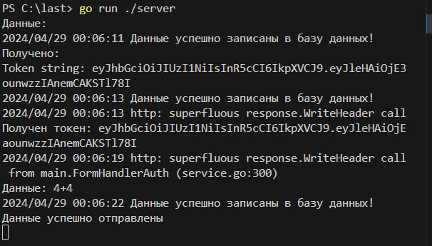

Всем привет, представляю проект по go-calculator-2

контакты для связи -  телеграмм https://t.me/AGALEEV

Оглавление 
### Примеры работы
### Структура Работы программы 
### Структура проекта (файлы и папки)
### Как запустить

# Команды для тестирования

**2 + 2 * 2 -> 6**
***
**2+2*(5+5) -> 22*
***
**(5*5 + 11)/(29 +3) -> 1.125**
***
**22/7 -> 3.142857142857143**

### Структура Работы программы
запустить сервер в 1ом терминале: go run .\server
запустить агента во 2ом терминале: go run .\cmd
перейти на http://127.0.0.1:8080

### Что сделано а что нет

реализован jwt
реализован html
реализована БД sqlite
нереализован grpc

### Что бы исправил

Вылет программы после неправильно введённого выражения

### Пример

#

